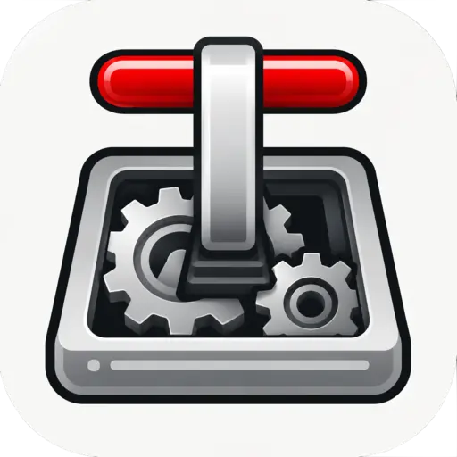
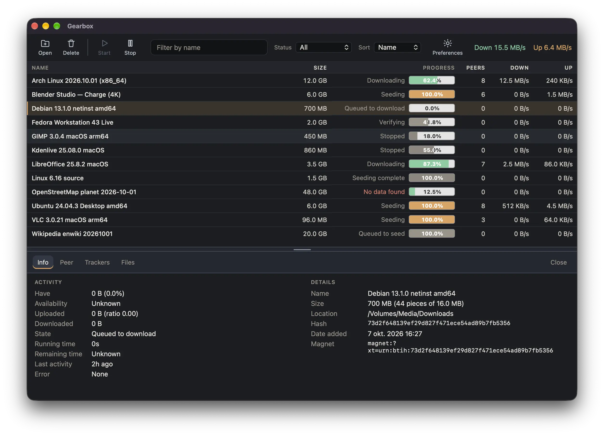

# Gearbox



macOS client for a remote Transmission daemon.

Watch downloads, add torrents, and start or stop them from a native app — with Keychain passwords and Transmission’s JSON-RPC.

- [Gearbox](#gearbox)
  - [Features](#features)
  - [Installation](#installation)
    - [Homebrew](#homebrew)
    - [Download](#download)
    - [Build from source](#build-from-source)
  - [Build and Run](#build-and-run)
  - [Configuration](#configuration)
  - [Gatekeeper note](#gatekeeper-note)

## Features



- **Remote Transmission** — talk to a Transmission 2.x–4.x daemon over its classic JSON-RPC (`http` or `https`)
- **Torrent list** — name, size, progress, peers, and up/down rates, with session totals in the toolbar
- **Filter & sort** — narrow by name or status (active, downloading, seeding, paused, finished, error); sort by name, size, progress, peers, speed, ratio, or status
- **Add torrents** — `.torrent` files, magnet links, or http(s) URLs, with a destination folder and free-space check
- **Open With** — open a `.torrent` file or a magnet link in Gearbox and send it straight to the daemon
- **Start, stop & remove** — resume or pause the selection; remove torrents from the list, or trash the downloaded files too
- **Inspector** — info, peers, trackers, and files for the selected torrent
- **macOS Keychain** — store the RPC password securely; preferences on disk never contain the secret
- **Auto-refresh** — poll the daemon on an interval you set (1–3600 seconds)
- **Native menus** — Gearbox, File, Edit, View, and Window, plus a context menu on each row

## Installation

### Homebrew

```bash
brew tap stenstromen/tap
brew install --cask gearbox
```

### Download

Download the latest macOS DMG from the [Releases page](https://github.com/stenstromen/gearbox/releases/latest/).

### Build from source

Requires macOS 12+, Go, Node.js, [Task](https://taskfile.dev/), and [Wails v3](https://v3.wails.io/).

```bash
git clone https://github.com/stenstromen/gearbox.git
cd gearbox
task package
```

## Build and Run

```bash
task dev                       # live reload in development mode
task build                     # compile the current architecture
task package                   # production gearbox.app
task darwin:package:universal  # universal arm64 + amd64 gearbox.app
task darwin:package:dmg        # styled .dmg (current architecture)
```

Open **Preferences** and set the Transmission URL, for example `http://127.0.0.1:9091/transmission/rpc`. A host without a path is completed to `/transmission/rpc`. Username and password are optional when the daemon does not require them.

## Configuration

Preferences live in:

```text
~/Library/Application Support/Gearbox/preferences.json
```

The RPC password is stored in the macOS Keychain under `se.stenstromen.gearbox`, not in that file.

Until a URL has been saved, Gearbox falls back to:

```text
TRANSMISSION_URL
TRANSMISSION_USERNAME
TRANSMISSION_PASSWORD
```

`GEARBOX_CONFIG` overrides the preferences file path.

## Gatekeeper note

Release builds are ad-hoc signed until Developer ID notarization is enabled. On first open, macOS may ask you to allow the app under **System Settings → Privacy & Security**. You can also right-click the app and choose **Open**.
